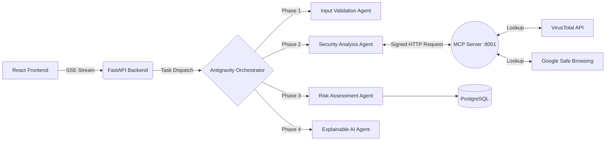
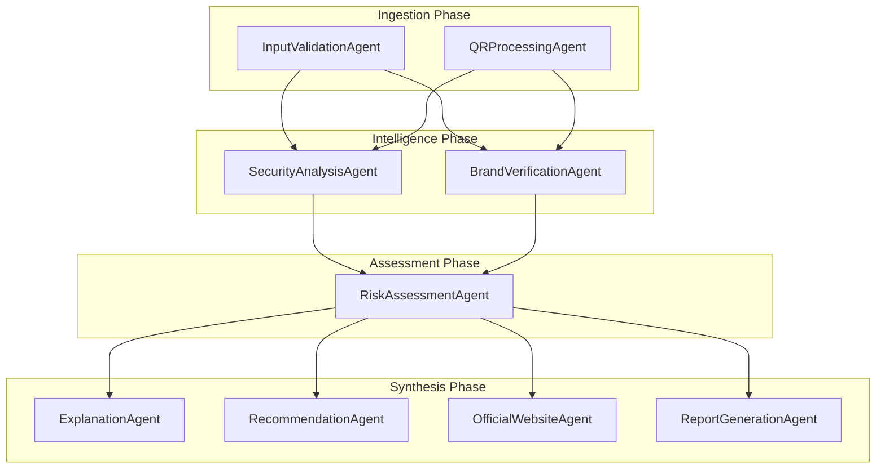
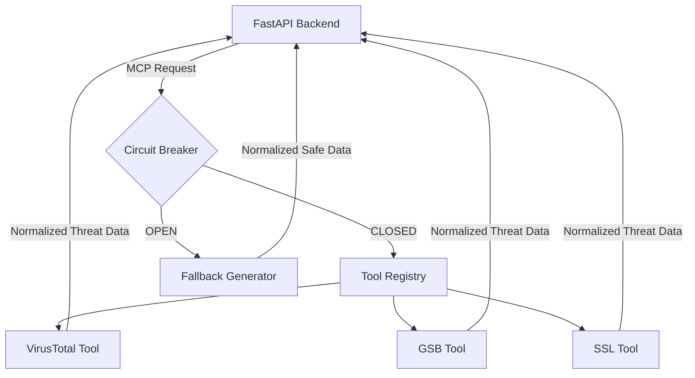
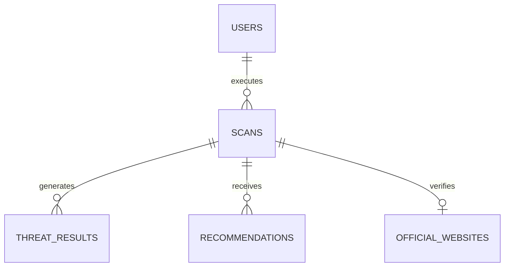

# TrustGuardAI 🛡️


An Enterprise-Grade, Multi-Agent Cybersecurity Threat Intelligence Platform.  
Built explicitly for the **Google AI Agents Capstone**.

---

## 📖 Project Overview

### Problem Statement
Modern cyber threats, such as zero-day phishing campaigns and typosquatting attacks, bypass traditional heuristic firewalls. Furthermore, existing threat intelligence tools dump raw, highly technical JSON payloads (e.g., `ERR_SSL_PROTOCOL_ERROR`) that non-technical users cannot decipher, leaving them vulnerable to social engineering.

### Solution
TrustGuardAI bridges the gap between deep technical intelligence and human readability. By leveraging an asynchronous, DAG-based **Multi-Agent System (Antigravity Engine)**, the platform queries global threat databases (VirusTotal, Google Safe Browsing, crt.sh) via the **Model Context Protocol (MCP)**. 
A dedicated **Explainable AI (XAI)** Agent then intercepts these technical flags and translates them into educational, actionable English, rendering the results on a beautiful Glassmorphism dashboard.

---

## ✨ Key Features
- **True Multi-Agent Orchestration**: 9 independent Google ADK agents running in a highly optimized Directed Acyclic Graph (DAG) pipeline.
- **Model Context Protocol (MCP)**: Strict Clean Architecture. The core backend **never** makes direct external HTTP requests. All intelligence gathering is piped securely through a standalone MCP server guarded by a stateful Circuit Breaker.
- **Explainable AI (XAI)**: Converts raw JSON into educational tips, UI accordions, and personalized AI recommendations.
- **Enterprise Reporting**: Generate and download professional PDF, Markdown, and JSON security reports dynamically.
- **Advanced Analytics**: Real-time Recharts visualizations powered by TTL-cached PostgreSQL aggregations.

---

## 🛠️ Technology Stack
- **Frontend**: React 18, TypeScript, TailwindCSS, Framer Motion, Recharts, Vitest
- **Backend**: FastAPI, SQLAlchemy (asyncpg), Pydantic, Pytest
- **Multi-Agent Orchestration**: Custom `Antigravity` DAG Engine (Python `asyncio`)
- **Protocol**: Custom Model Context Protocol (MCP) server on port `8001`
- **Database**: PostgreSQL 15 (with `pgvector` available for future embedding support)
- **Containerization**: Docker, Docker Compose, GitHub Actions CI/CD

---

## 🏛️ Architecture & Developer Guide

### 1. Overall Flow


### 2. The Google ADK Multi-Agent Engine
Our custom `Antigravity` engine orchestrates 9 highly isolated AI agents. Each agent mutates a Pydantic `SharedContext` state object as it passes through the pipeline.


### 3. The Model Context Protocol (MCP) Server
The backend is completely shielded from external API failures. If VirusTotal hits a `429 Too Many Requests`, the MCP Circuit Breaker trips to `OPEN` and injects normalized fallback data into the Multi-Agent pipeline, preventing deadlocks.


### 4. Database ER Diagram


---

## 📂 Project Structure

```text
TrustGuardAI/
├── backend/                  # FastAPI Main Application
│   ├── app/
│   │   ├── agents/           # The 9 Google ADK Agents
│   │   ├── controllers/      # API Routers (Auth, Scan, Analytics)
│   │   ├── models/           # SQLAlchemy ORM Models
│   │   ├── services/         # Business Logic (JWT, PDFs)
│   │   ├── workflows/        # Antigravity DAG Orchestrator
│   │   └── main.py           # FastAPI Entrypoint
│   ├── tests/                # Pytest Suite
│   └── Dockerfile
├── frontend/                 # React UI
│   ├── src/
│   │   ├── components/       # Reusable Glassmorphism UI
│   │   ├── pages/            # Dashboard, Results, Scanners
│   │   └── tests/            # Vitest Suite
│   └── Dockerfile
├── mcp/                      # Standalone MCP Server
│   ├── tools/                # Extensible Tool Registry
│   ├── server.py             # MCP Entrypoint (:8001)
│   └── Dockerfile
├── docker-compose.yml        # Orchestrates 4 Containers
└── README.md                 # You are here
```

---

## ⚡ Setup & Installation

### Environment Variables
Create a `.env` file inside the `mcp/` directory. (If left blank, the Circuit Breaker will gracefully handle fallback data).
```ini
VIRUSTOTAL_API_KEY=your_vt_key
GOOGLE_SAFE_BROWSING_API_KEY=your_gsb_key
```

### Running via Docker (Recommended)
Ensure you have Docker Engine and Docker Compose installed. Execute the following command from the root directory:
```bash
docker-compose up --build -d
```
The architecture will boot across 4 isolated containers:
1. `db`: PostgreSQL Database on `5432`.
2. `mcp`: MCP Server on `8001`.
3. `backend`: FastAPI Engine on `8000`.
4. `frontend`: Nginx serving React on `3000`.

Navigate to **http://localhost:3000** in your browser.

### Cloud Deployment
- **Frontend**: Deploy the `frontend/` directory to **Vercel** with the build command `npm run build`.
- **Backend & MCP**: Deploy the `backend/Dockerfile` and `mcp/Dockerfile` to **Google Cloud Run** or **Render**, ensuring the `MCP_SERVER_URL` environment variable points to the internal MCP IP.

---

## 📚 API Documentation (Swagger)
Once the backend is running, the fully documented OpenAPI interface is available at:  
👉 `http://localhost:8000/docs`

### Example Request (`POST /api/scan/url`)
```json
{
  "target": "https://paypal-secure-login.com"
}
```

### Example Server-Sent Events (SSE) Stream
```json
data: {"step": "SecurityAnalysisAgent", "status": "running"}
data: {"step": "SecurityAnalysisAgent", "status": "complete", "result": {"threat_intel_flags": ["VT_FLAG", "GSB_FLAG"]}}
```

---

## 📸 Screenshots

*(Replace these placeholders with actual screenshots from your repository)*

| Dashboard | Real-time SSE Scanning |
|-----------|------------------------|
| `` | `` |

| Explainable AI Results | PDF Report Generation |
|------------------------|-----------------------|
| `` | `` |

---

## 🔮 Future Scope
- **LLM Embeddings**: Integrate `pgvector` to run semantic searches across historical threat reports.
- **Browser Extension**: Port the React application into a Chrome extension for real-time URL interception.
- **Dynamic Kubernetes**: Orchestrate the individual ADK agents as separate serverless functions.

---

## 🙌 Acknowledgements
Built by varsh for the **Google AI Agents Capstone**. 
Thanks to the open-source community behind FastAPI, React, and Recharts.

---

## 📄 License
This project is licensed under the MIT License - see the [LICENSE](LICENSE) file for details.
